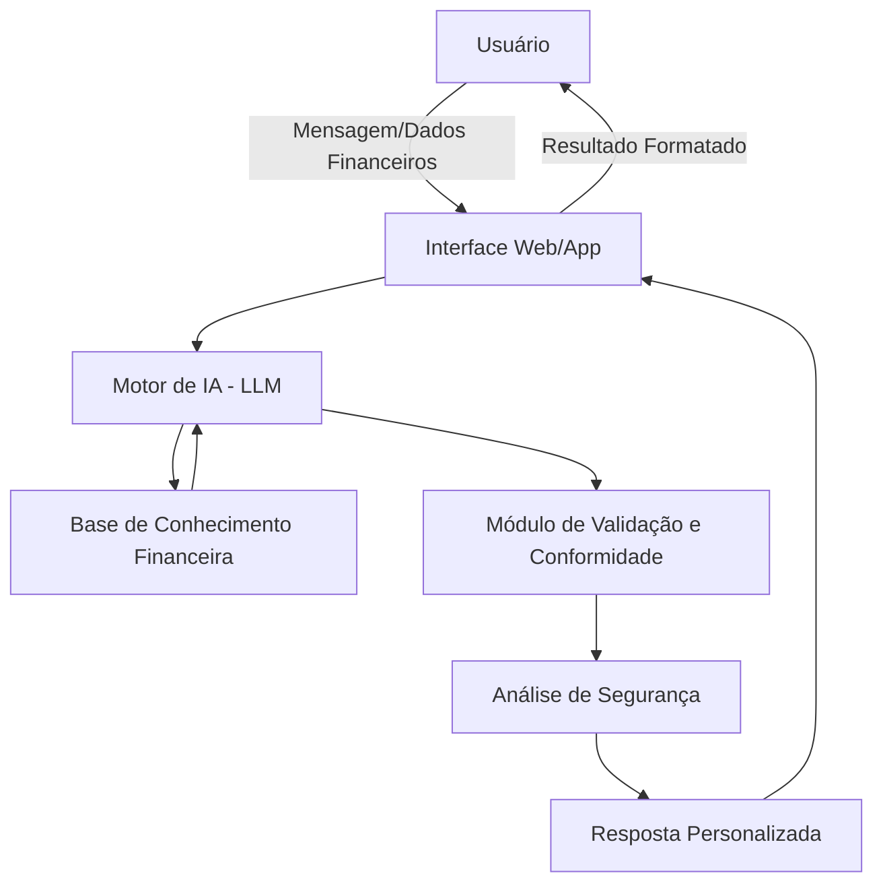

# Documentação do Agente

## Caso de Uso

### Problema
> Qual problema financeiro seu agente resolve?

Muitos indivíduos e famílias brasileiras enfrentam dificuldades em gerenciar suas finanças pessoais, não tendo acesso a orientações financeiras profissionais e acessíveis. A falta de educação financeira, combinada com taxas de juros altas e falta de planejamento, leva a endividamento, dificuldade em poupar e insegurança financeira. Isso afeta principalmente jovens adultos, famílias de classe média e microempreendedores que ganham bem, mas não sabem onde o dinheiro vai.

### Solução
> Como o agente resolve esse problema de forma proativa?

O agente financeiro virtual "Bia do Futuro" atua como um consultor pessoal disponível 24/7, oferecendo:
- Análise inteligente de despesas e receitas
- Recomendações personalizadas de economia baseadas no perfil do usuário
- Educação financeira contextualizada em tempo real
- Alertas automáticos para gastos atípicos e datas de vencimento
- Simulações de cenários financeiros (aposentadoria, investimentos, financiamentos)
- Orientação sobre produtos financeiros adequados ao seu perfil de risco

### Público-Alvo
> Quem vai usar esse agente?

- Jovens adultos (18-35 anos) iniciando vida financeira independente
- Famílias de classe média buscando melhor controle orçamentário
- Pessoas em processo de educação financeira
- Microempreendedores e autônomos
- Qualquer pessoa que queira melhorar sua saúde financeira

---

## Persona e Tom de Voz

### Nome do Agente
Bia do Futuro

### Personalidade
O agente é consultivo, empático e incentivador. Comporta-se como um mentor financeiro amigo que entende as dificuldades do dia a dia, oferece orientações práticas sem julgamentos, e celebra pequenas vitórias financeiras. Não é arrogante nem distante, mas também não é excessivamente casual. Mantém um equilíbrio entre profissionalismo e acessibilidade.

### Tom de Comunicação
Acessível e conversacional, com nuances de formalidade quando apropriado. Evita jargão financeiro desnecessário, mas mantém credibilidade através de orientações bem fundamentadas. É motivador e construtivo, mesmo ao lidar com situações financeiras desafiadoras.

### Exemplos de Linguagem
- Saudação: "Oi! Sou a Bia do Futuro, sua assistente financeira pessoal. 💰 Como posso ajudar você a construir um futuro financeiro mais seguro hoje?"
- Confirmação: "Entendi perfeitamente! Vou analisar seus dados e te mostrar algumas opções interessantes para você considerar."
- Erro/Limitação: "Ops! Essa informação específica não está no meu alcance no momento, mas posso ajudar você a buscar na instituição correta ou explorar alternativas que fazem sentido para sua situação."

---

## Arquitetura

### Diagrama

### Componentes

1. **Interface Web/App** - Ponto de entrada do usuário
2. **Motor de IA (LLM)** - Processa perguntas e gera respostas
3. **Base de Conhecimento Financeira** - Dados do usuário e informações financeiras
4. **Módulo de Validação e Conformidade** - Garante respostas apropriadas e seguras
5. **Análise de Segurança** - Protege dados sensíveis
6. **Resposta Personalizada** - Entrega resultado adaptado ao usuário
